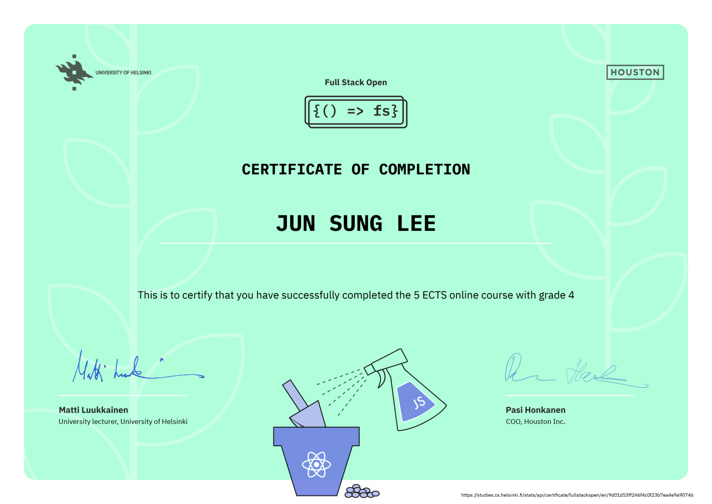

# [Full Stack Open 2021](https://fullstackopen.com/en/ "Full Stack Open 2021 Homepage")

This course by the University of Helsinki is an introduction to modern web development with JavaScript. The focus is on single page applications
implemented with React and supported with RESTful and GraphQL web services implemented with Node.js. Other topics include debugging applications, configuration, and managing runtime environments and NoSQL databases.

This repo contains my certificate of completion and exercises to the 2021 course.

](https://studies.cs.helsinki.fi/stats/api/certificate/fullstackopen/en/9d01d53ff246f4c0f23b7ea4e9a90746)

## Table of Contents

### Part 0: Fundamentals of Web apps

- [General info](https://fullstackopen.com/en/part0/general_info)
- [Fundamentals of Web apps](https://fullstackopen.com/en/part0/fundamentals_of_web_apps)

### Part 1: Introduction to React

- [Introduction to React](https://fullstackopen.com/en/part1/introduction_to_react)
- [Javascript](https://fullstackopen.com/en/part1/java_script)
- [Component state, event handlers](https://fullstackopen.com/en/part1/component_state_event_handlers)
- [A more complex state, debugging React apps](https://fullstackopen.com/en/part1/a_more_complex_state_debugging_react_apps)

### Part 2: Communicating with server

- [Rendering a collection, modules](https://fullstackopen.com/en/part2/rendering_a_collection_modules)
- [Forms](https://fullstackopen.com/en/part2/forms)
- [Getting data from server](https://fullstackopen.com/en/part2/getting_data_from_server)
- [Altering data in server](https://fullstackopen.com/en/part2/altering_data_in_server)
- [Adding styles to React app](https://fullstackopen.com/en/part2/adding_styles_to_react_app)

### Part 3: Programming a server with NodeJS and Express

- [Node.js and Express](https://fullstackopen.com/en/part3/node_js_and_express)
- [Deploying app to internet](https://fullstackopen.com/en/part3/deploying_app_to_internet)
- [Saving data to MongoDB](https://fullstackopen.com/en/part3/saving_data_to_mongo_db)
- [Validation and ESLint](https://fullstackopen.com/en/part3/validation_and_es_lint)

### Part 4: Testing Express servers, user administration

- [Structure of backend application, introduction to testing](https://fullstackopen.com/en/part4/structure_of_backend_application_introduction_to_testing)
- [Testing the backend](https://fullstackopen.com/en/part4/testing_the_backend)
- [User administration](https://fullstackopen.com/en/part4/user_administration)
- [Token authentication](https://fullstackopen.com/en/part4/token_authentication)

### Part 5: Testing React apps, custom hooks

- [Login in frontend](https://fullstackopen.com/en/part5/login_in_frontend)
- [props.children and proptypes](https://fullstackopen.com/en/part5/props_children_and_proptypes)
- [Testing React apps](https://fullstackopen.com/en/part5/testing_react_apps)
- [End to end -testing](https://fullstackopen.com/en/part5/end_to_end_testing)
